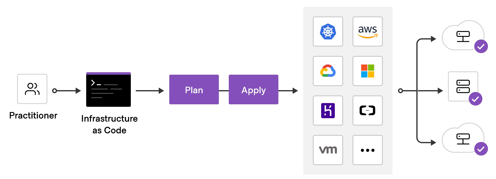

# Terraform 工作流

## 官网

https://www.terraform.io/intro/core-workflow

## 实战演习/说明讲解

>看图说话



+ 初始化 - init
+ 校验文件 - validate
+ 计划实施 - plan
+ 应用部署 - apply
+ 摧毁系统 - destroy

## 操作步骤

### 初始化 - init

```bash
$ terraform init
```

+ 初始化工作文件夹
+ 准备提供商组件

### 校验文件 - validate

```bash
$ terraform validate
```

+ 编译校验本地部署文件， 确保正确无误

### 计划实施 - plan

```bash
$ terraform plan
```

+ 根据本地部署文件， 根据不同的云提供商， 建立不同的部署实施计划

### 应用部署 - apply

```bash
$ terraform apply
```

+ 应用部署到各个云平台

### 摧毁系统 - destroy

```bash
$ terraform destroy
```

+ 系统周期完成时， 摧毁系统