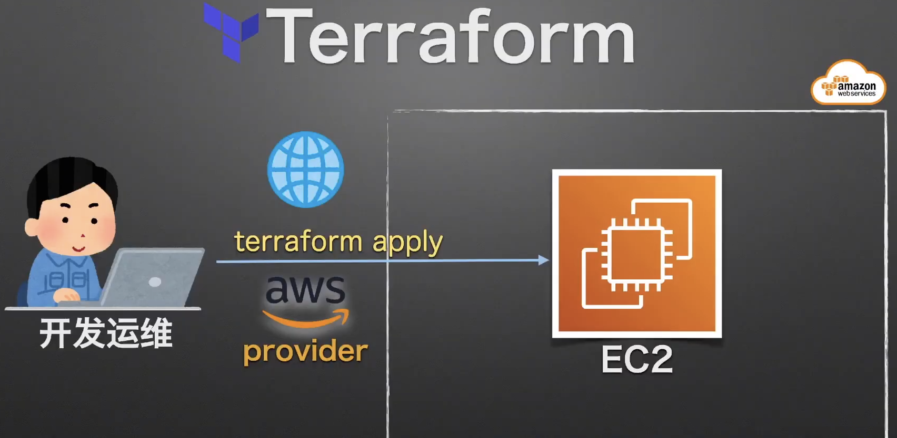

快速建立第一个 EC2 实例 - 本地授权方式
=====================

## 知识点

* 使用 Terraform 快速建立第一个 EC2 实例

## 官网

https://registry.terraform.io/

* Terraform Registry是Terraform的注册机，相当于java的maven、Nodejs的NPMjs，这里集成了所以Terraform的中间件，主要分为两个类型：
  * Providers：提供器，几乎是官方维护。例如要建立AWS基于Terraform的平台，就需要AWS的提供器来支持后端的云平台。
  * Modules：模块，几乎是个人或组织维护。有了上面很多的提供器，想高效的使用就需要用到模块。

## 实战演习/说明讲解



+ 建立本地 Terraform 文件, (简称 tf 文件)
+ 遵循 Terraform 工作流程完成资源部署 - init、validate、plan、apply、destroy
+ 动作确认

## 操作步骤

### 建立本地 Terraform 文件, (简称 tf 文件)

```bash
$ mkdir awstf
$ cd awstf
$ vim main.tf
```

*main.tf*

```bash
###########################################################
# Terraform 基本设置
terraform {
	# 声明provider
  required_providers {
  	# https://registry.terraform.io/browse/providers
    aws = {
      source  = "hashicorp/aws"
      version = "~> 3.74"
    }
  }
	# 声明Terraform版本
  required_version = ">= 1.1.4"
}

###########################################################
# 提供商设置(云平台)
# 描述AWS Provider
# https://registry.terraform.io/providers/hashicorp/aws/latest
provider "aws" {
	# ~/.aws/credentials文件的[name]
  profile = "learnaws"
  region  = "ap-northeast-1"
}

###########################################################
# 描述要生成的资源设置
# https://registry.terraform.io/providers/hashicorp/aws/latest/docs/resources/ami
# https://registry.terraform.io/providers/hashicorp/aws/latest/docs/resources/instance
resource "aws_instance" "myweb_server" {
  ami           = "ami-0218d08a1f9dac831"
  instance_type = "t3.micro"
  tags = {
    Name = "learnaws-ec2-from-terraform"
  }
}
```

### 遵循 Terraform 工作流程完成资源部署

```bash
# 目录初始化（会现在必要的安装包和provider）
$ terraform init
# 确认提供商管理文件, 该文件记录具体的提供商版本信息, 应该包含到源代码信息库中
$ ls -a
$ cat .terraform.lock.hcl

# 检验 tf 文件
$ terraform validate

# 实施计划, 准备资源
$ terraform plan
...
>Plan: 1 to add, 0 to change, 0 to destroy.

# 应用部署
$ terraform apply
...
>Apply complete! Resources: 1 added, 0 changed, 0 destroyed.

# 摧毁系统，即把当前tf脚本描述的所有资源全部摧毁
$ terraform destroy
...
>Destroy complete! Resources: 1 destroyed.
```

### 动作确认

Done.