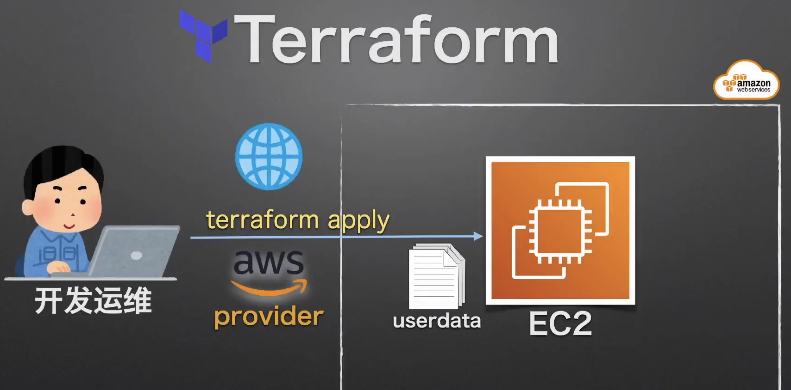

# 使用 EC2 用户数据

## 知识点

* 启动 EC2 时准备用户数据

## 实战演习/说明讲解



+ 准备用户数据文件
+ 修改 EC2 资源配置文件
+ 部署确认

## 操作步骤

### 目录结构

```bash
.
├── ec2.tf
├── main.tf
└── ec2-userdata.sh
```


### 准备用户数据文件

*ec2-userdata.sh*

```sh
#!/bin/bash
yum update -y
# 设置ec2区域
timedatectl set-timezone "Asia/Tokyo"
localectl set-locale LANG=ja_JP.UTF-8
touch /home/ec2-user/.hushlogin
chown ec2-user:ec2-user /home/ec2-user/.hushlogin
# 安装aws cli命令行工具
curl "https://awscli.amazonaws.com/awscli-exe-linux-x86_64.zip" -o "/tmp/awscliv2.zip"
unzip /tmp/awscliv2.zip  -d /tmp/awscliv2/
/tmp/awscliv2/aws/install
# 安装Nodejs
curl -sL https://rpm.nodesource.com/setup_14.x | bash -
yum install -y gcc-c++ make
yum install -y nodejs
# 安装Apache开启80 http服务
yum install -y httpd
systemctl enable httpd
service httpd start  
sudo echo '<h1>Terraform EC2.</h1>' | sudo tee /var/www/html/index.html
```

### EC2 资源配置文件

*ec2.tf*

```terraform
###########################################################
# EC2 资源设置
resource "aws_instance" "myweb_server2" {
  ami           = "ami-0218d08a1f9dac831"
  instance_type = "t3.micro"
  # 用来ssh密钥登陆
  key_name      = "learnaws-ssh-key"
  # 引用ec2-userdata.sh脚本，${path.module}是当前路径
  user_data     = file("${path.module}/ec2-userdata.sh")
  tags = {
    Name = "learnaws-ec2-from-terraform2"
  }
}
```

### 项目描述文件

*main.tf*

```terraform
###########################################################
# Terraform 基本设置
terraform {
  required_providers {
    aws = {
      source  = "hashicorp/aws"
      version = "~> 3.74"
    }
  }
  required_version = ">= 1.1.4"
}

###########################################################
# 提供商设置(云平台)
provider "aws" {
  profile = "learnaws"
  region  = "ap-northeast-1"
}
```

### 部署确认

```bash
# 目录初始化
$ terraform init
# 检验 tf 文件
$ terraform validate
# 实施计划, 准备资源
$ terraform plan
# 应用部署
$ terraform apply
$ terraform apply -auto-approve	# 自动确认，会自动输入yes
# 摧毁系统
$ terraform destroy -auto-approve

# 访问ec2的ip，网页输出“Terraform EC2.”即成功
```

